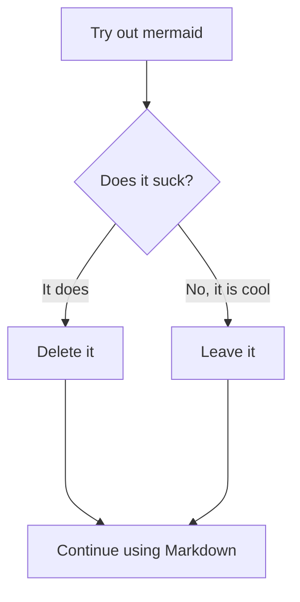

## Mermaid Flowchart

```mermaid
flowchart TD
    A[Try out mermaid] --> B{Does it suck?};
    B -- It does --> C[Delete it];
    B -- No, it is cool --> D[Leave it];
    C ----> E[Continue using Markdown];
    D ----> E[Continue using Markdown];
```
